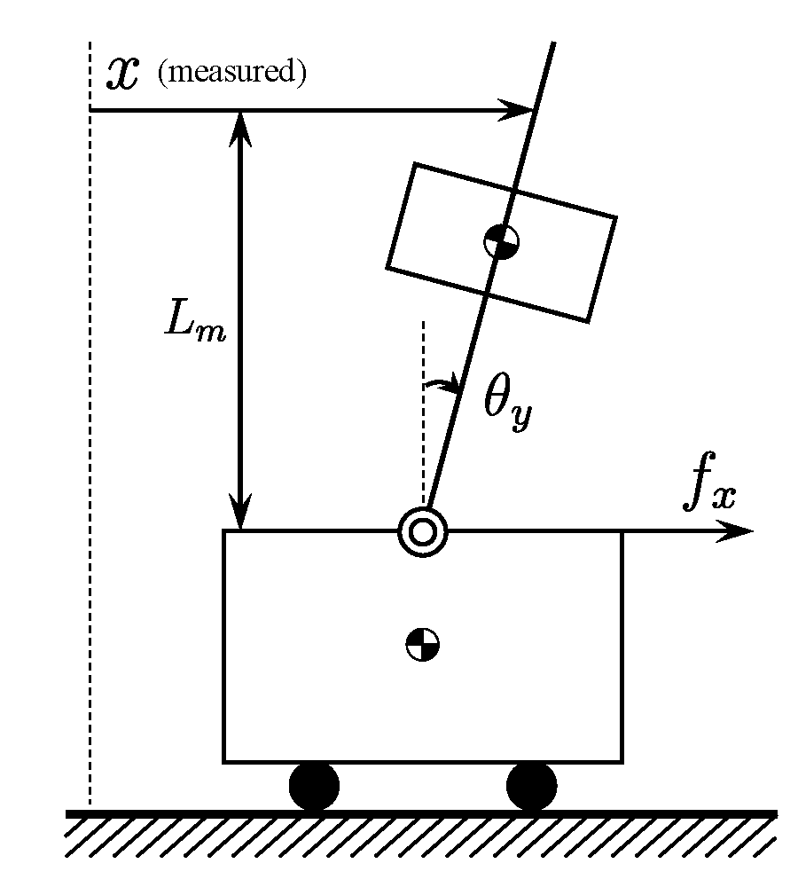
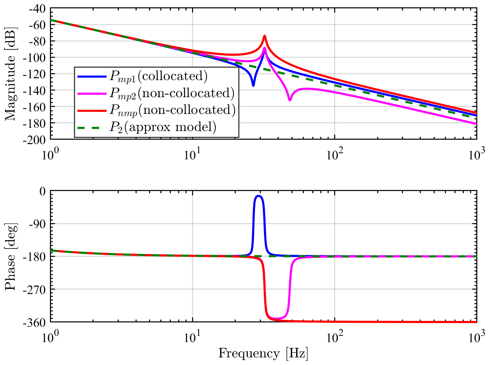

# control_benchmark
A benchmark problem for control-workshop. 

## Requirement
Tested by MATLAB R2017b. Some cords work for Octave 4.2.2.

## 4th order mechanical system
`func_plant_stage1(Lm)` outputs a 4th order continuous time model `Pc` as a function of the height of the measurement point `Lm`.
* `Pmp1` ($L_m=0$): collocated system with stable zeros
* `Pmp2` ($L_m=0.085$): **non-collocated** system with stable zeros
* `Pnmp` ($L_m=0.300$): non-collocated system with **unstable zeros**

 

### References
* [Application of Perfect Tracking Control to Large-Scale High-Precision Stage](https://www.sciencedirect.com/science/article/pii/S1474667015374802)
* [Basic examination on simultaneous optimization of mechanism and control for high precision single axis stage and experimental verification](http://ieeexplore.ieee.org/document/4758351/)

# Copyright and License

	2018-, Wataru Ohnishi, The University of Tokyo

control_benchmark is free software; you can redistribute it and/or modify it under the terms of the GNU General Public License as published by the Free Software Foundation; either version 3 of the License, or (at your option) any later version.

control_benchmark is distributed in the hope that it will be useful, but WITHOUT ANY WARRANTY; without even the implied warranty of MERCHANTABILITY or FITNESS FOR A PARTICULAR PURPOSE. See the GNU General Public License for more details.